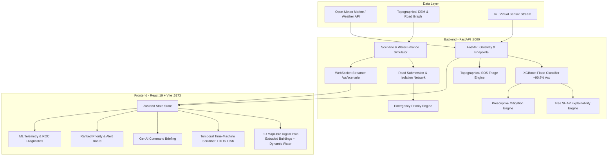

# 🌊 TIDALIS — Coastal Flood Intelligence Platform

> **"Know before the water arrives."**  
> AI-powered 3D coastal digital twin, flood forecasting, topographical emergency triage, and prescriptive disaster mitigation. Built for **Singularity 2026 — Track 1: AI for Coastal Flood Intelligence**.

[](https://fastapi.tiangolo.com/)
[](https://react.dev/)
[](https://vitejs.dev/)
[](https://maplibre.org/)
[](https://xgboost.readthedocs.io/)
[](https://www.python.org/)

---

## 📑 Table of Contents

- [Overview](#-overview)
- [System Architecture](#-system-architecture)
- [Key Features](#-key-features)
- [Prerequisites](#-prerequisites)
- [Quickstart: Run in 2 Minutes](#-quickstart-run-in-2-minutes)
  - [1. Backend Setup](#1-backend-setup-fastapi)
  - [2. Frontend Setup](#2-frontend-setup-react--vite)
- [Environment Configuration](#-environment-configuration)
- [3-Minute Interactive Demo Walkthrough](#-3-minute-interactive-demo-walkthrough)
- [API Reference](#-api-reference)
- [Testing & Quality Assurance](#-testing--quality-assurance)
- [Project Directory Structure](#-project-directory-structure)
- [Troubleshooting & FAQ](#-troubleshooting--faq)

---

## 💡 Overview

Coastal flood events are compounding disasters driven by synchronized storm surges, tidal peaks, and extreme precipitation. Traditional radar systems issue broad, passive "Flood Warnings" that lack local topography, egress route vulnerability, and actionable emergency triage.

**TIDALIS** bridges this gap by fusing environmental observations with a physical 3D digital twin:
1. **Predictive**: ML gradient-boosted models predict flood probability, onset time, peak severity, and hydrologic depth per urban zone.
2. **Spatially Aware**: Automatically calculates road submersion and isolates cut-off enclaves where all egress routes are severed.
3. **Explainable**: Uses Tree SHAP values to surface the exact physical drivers (surge vs. rain vs. drainage) behind every alert.
4. **Prescriptive**: Recommends prioritized, resource-specific mitigations (e.g., pump deployment, flood gates, evacuation staging).
5. **Topographical Triage**: Cross-references stranded citizen SOS pings against live water levels and digital elevation models ($Elevation - FloodDepth$) to rank rescue urgency.

---

## 🏗️ System Architecture



---

## 🌟 Key Features

| Feature | Description | Tech Used |
| :--- | :--- | :--- |
| **3D Digital Twin Map** | Photorealistic dark-oceanic map with extruded 3D buildings and translucent rising water that swallows low-lying roads. | MapLibre GL, GeoJSON, WebGL |
| **Temporal Time-Machine** | Interactive slider scrubbing through the 5-hour coastal storm ($T=0$ to $T=5h$) in 15-minute steps. | Zustand, REST / WebSocket |
| **Live Control Room** | "Play Scenario" button streaming live storm snapshots at 0.8s intervals over WebSockets. | FastAPI WebSockets, AsyncIO |
| **Dynamic Isolation Detection** | Real-time graph analysis flagging neighborhoods where all egress routes are underwater. | Network Graph, Topology |
| **Topographical SOS Triage** | Evaluates distress signals based on $Margin = Elevation - WaterDepth$, auto-assigning rescue methods (Helicopter, Boat, Wade Team). | DEM, SOS Engine |
| **Prescriptive Mitigation** | Generates tactical plans (action, cost, time-to-deploy, equipment) tailored to the active threat vector. | Rule-based Expert System |
| **GenAI Command Brief** | Natural-language emergency summaries grounded strictly in SHAP driver values (zero hallucinations). | Deterministic LLM Briefing |
| **ML Telemetry Dashboard** | Technical diagnostic view displaying live accuracy, ROC curves, F1 scores, and inference latency logs. | Recharts, Scikit-Learn |

---

## 📋 Prerequisites

Ensure you have the following installed on your machine:
- **Python**: `3.10` or higher (Python `3.12` recommended)
- **Node.js**: `18.0.0` or higher (tested with Node `v20` / `v24`)
- **Package Managers**: `pip` and `npm`
- **Git**

---

## 🚀 Quickstart: Run in 2 Minutes

Follow these steps to launch both the backend and frontend services.

### 1. Backend Setup (FastAPI)

Open a terminal at the repository root (`Zero_T1-1/`):

#### Windows (PowerShell)
```powershell
# 1. Create and activate a Python virtual environment
python -m venv .venv
.\.venv\Scripts\Activate.ps1

# 2. Install Python dependencies
pip install -r requirements.txt

# 3. (Optional) Copy environment variables template
Copy-Item .env.example .env

# 4. Generate the 3D digital-twin GeoJSON assets (if not already built)
python -m scripts.generate_geo

# 5. Start the backend API server
python main.py
```

#### macOS / Linux (Bash)
```bash
# 1. Create and activate a Python virtual environment
python3 -m venv .venv
source .venv/bin/activate

# 2. Install Python dependencies
pip install -r requirements.txt

# 3. (Optional) Copy environment variables template
cp .env.example .env

# 4. Generate the 3D digital-twin GeoJSON assets
python -m scripts.generate_geo

# 5. Start the backend API server
python main.py
```

> **Alternatively**, you can launch via Uvicorn directly:
> ```bash
> uvicorn backend.app.main:app --reload --host 0.0.0.0 --port 8000
> ```

✅ **Backend Verification**:
- Health Check: Open [http://localhost:8000/api/health](http://localhost:8000/api/health) in your browser. You should see `"status": "ok"`.
- Interactive Swagger API Docs: Open [http://localhost:8000/docs](http://localhost:8000/docs).

---

### 2. Frontend Setup (React + Vite)

Open a **second** terminal window and navigate to the `frontend/` directory:

```bash
cd frontend

# 1. Install frontend packages
npm install

# 2. Start the Vite development server
npm run dev
```

The frontend will start at:
👉 **[http://localhost:5173](http://localhost:5173)**

Open that URL in Google Chrome, Edge, or Firefox. The interface will immediately connect to `http://localhost:8000` and display the digital twin control room!

---

## ⚙️ Environment Configuration

The application works out-of-the-box with sensible defaults and built-in demo scenarios. No external paid API keys are required.

To customize settings, edit `.env` in the root directory:

```ini
APP_ENV=development
APP_DEBUG=true

# Open-Meteo API (Free tier, no API key required)
OPEN_METEO_BASE_URL=https://marine-api.open-meteo.com/v1/marine

# Optional External Satellite Feeds
COPERNICUS_CLIENT_ID=
COPERNICUS_CLIENT_SECRET=
COPERNICUS_MARINE_USERNAME=
COPERNICUS_MARINE_PASSWORD=
NASA_EARTHDATA_TOKEN=
GFW_API_TOKEN=

# Optional LLM Integration (Deterministic templates run if empty)
OPENAI_API_KEY=

# Frontend Backend Target (Vite dev server)
VITE_API_URL=http://localhost:8000
```

---

## 🎮 3-Minute Interactive Demo Walkthrough

Follow this script to experience or present the core capabilities:

1. **Inspect Initial State ($T+0.0h$)**:
   - The map displays a coastal district in calm conditions.
   - Water opacity is minimal, all roads are green (passable), and the priority board shows low severity.
2. **Toggle 3D Digital Twin View**:
   - Click the **3D** toggle button on the map control bar.
   - The camera pitches to $58^\circ$, revealing 3D extruded building footprints with elevations.
3. **Scrub the Temporal Time-Machine**:
   - Drag the bottom timeline slider forward from $T+0.00h \rightarrow T+2.50h \rightarrow T+4.00h$.
   - **Watch the physical change**:
     - The translucent flood layer rises and expands.
     - Low-elevation roads turn red as they are submerged.
     - **Enclaves isolate**: Zone B is flagged as an `ISOLATED ENCLAVE` when all its egress roads become impassable.
4. **Notice Autonomous Priority Escalation**:
   - In the right-hand **Priority Board**, Zone B instantly shoots to the #1 priority spot with an `ISOLATED` badge.
5. **Read the Grounded Command Brief**:
   - Review the **GenAI Command Brief** panel. It explains in clear natural language *why* the zone is critical, citing specific rainfall and tide contributions derived from SHAP values.
6. **Trigger WebSocket Live Stream**:
   - Click **Play** on the timeline scrubber. The dashboard enters live streaming mode, ticking forward through the storm every 0.8 seconds while real-time alert cards pulse into the left feed.
7. **Submit & Inspect Topographical SOS**:
   - Open the **SOS Triage** tab.
   - Click anywhere on the map or submit a distress ping. Notice how the system calculates the caller's ground elevation against current flood depth to recommend **Helicopter**, **Rescue Boat**, or **Wade Team**.
8. **Inspect Mitigation Actions**:
   - Click the **Mitigation** tab to see prioritized tactical recommendations: pump deployment coordinates, mobile barrier placement, and evacuation staging orders.
9. **Explore the ML Telemetry Dashboard**:
   - Click the **ML Telemetry** button in the header.
   - Inspect the live hold-out evaluation metrics: **~90.8% Accuracy**, **0.90 AUC**, confusion matrix, feature importance weights, and streaming inference logs.

---

## 📡 API Reference

The FastAPI backend exposes the following key endpoints:

### Core & Scenario Intelligence
| Method | Endpoint | Description |
| :--- | :--- | :--- |
| `GET` | `/api/health` | Service health status, active sensors, and event counts |
| `GET` | `/api/scenario` | Metadata and 21-step timeline index for the storm scenario |
| `GET` | `/api/scenario/snapshot?t={float}` | Comprehensive intelligence snapshot for time $T$ ($0.0 \le t \le 5.0$) |
| `WS` | `/ws/scenario` | WebSocket for bi-directional scenario playback (`play`, `pause`, `seek`, `reset`) |
| `GET` | `/api/geo` | GeoJSON layers bundle (zones, roads, 3D buildings, facilities, nodes) |

### Environmental & ML Services
| Method | Endpoint | Description |
| :--- | :--- | :--- |
| `GET` | `/api/coastal-state` | Current aggregated coastal status, sensors, and marine observations |
| `GET` | `/api/sensors` | List all IoT water-level, turbidity, and temperature sensors |
| `GET` | `/api/sensors/{id}/observations` | Historical sensor time-series readings |
| `GET` | `/api/anomalies` | Real-time Z-score sensor anomaly detections |
| `GET` | `/api/events` | Active coastal flood events |
| `GET` | `/api/forecast?event_id={id}` | Predictive multi-step flood forecast |
| `GET` | `/api/exposure?event_id={id}` | Critical infrastructure and asset exposure ranking |
| `GET` | `/api/mitigation?event_id={id}` | Prescriptive mitigation intervention plan |
| `POST` | `/api/simulation/what-if` | Run parameter-altered what-if flood spread scenarios |
| `POST` | `/api/copilot` | Natural-language query interface with grounding |
| `GET` | `/api/ml/telemetry` | Model diagnostics, hold-out accuracy, ROC, drift, and inference logs |

### Emergency SOS Triage
| Method | Endpoint | Description |
| :--- | :--- | :--- |
| `GET` | `/api/sos` | List all submitted SOS tickets sorted by urgency |
| `POST` | `/api/sos` | Submit a distress ping with GPS coordinates and victim count |
| `PATCH` | `/api/sos/{id}?status={status}` | Update ticket lifecycle (`DISPATCHED`, `EN_ROUTE`, `RESCUED`) |

---

## 🧪 Testing & Quality Assurance

### Run Backend Unit Tests
Execute the comprehensive test suite covering the hydrologic models, priority algorithm, isolation engine, and scenario snapshots:

```bash
# Run all core and scenario tests
pytest backend/tests/test_scenario.py backend/tests/test_core.py -v
```

### Validate Frontend
Verify frontend bundle build and linting:

```bash
cd frontend

# Run linter
npm run lint

# Compile production build
npm run build
```

### Test Data Generators
Regenerate or inspect the synthetic digital-twin geometry and demo seeds:

```bash
# Generate GeoJSON datasets
python -m scripts.generate_geo

# Seed demo sensors, events, and asset exposures
python -m scripts.seed_demo_data
```

---

## 📂 Project Directory Structure

```text
Zero_T1-1/
├── backend/                        # FastAPI Python backend
│   ├── app/
│   │   ├── copilot/                # Command brief & LLM explainability
│   │   ├── fusion/                 # Sensor & satellite anomaly fusion
│   │   ├── geospatial/             # Digital-twin district model & GeoJSON
│   │   ├── ml/                     # XGBoost classifier, SHAP & telemetry
│   │   ├── models/                 # Unified Pydantic data schemas
│   │   ├── scenario/               # 5-hour storm scenario & water balance
│   │   ├── services/               # Priority, isolation, SOS & mitigation engines
│   │   ├── simulation/             # What-if scenario spread simulation
│   │   └── main.py                 # FastAPI application & WebSocket handlers
│   └── tests/                      # Pytest automated test suites
├── data/
│   └── geo/                        # Generated GeoJSON layers (buildings, zones, roads)
├── data_collection/                # Multi-source ingestion pipelines (Open-Meteo, NOAA)
├── frontend/                       # React 19 + Vite frontend
│   ├── src/
│   │   ├── components/             # UI panels (3D Map, Scrubber, SOS, Telemetry)
│   │   ├── lib/api.js              # REST & WebSocket client
│   │   ├── store.js                # Global Zustand scenario state
│   │   ├── App.jsx                 # Main layout & panel composition
│   │   └── index.css               # Design system & dark-mode styling
│   ├── package.json
│   └── vite.config.js
├── scripts/
│   ├── generate_geo.py             # Generates data/geo/*.geojson
│   └── seed_demo_data.py           # Populates in-memory demo data
├── .env.example                    # Environment variable template
├── main.py                         # Root entrypoint runner
├── requirements.txt                # Python backend dependencies
└── README.md                       # Comprehensive platform documentation
```

---

## 🛠️ Troubleshooting & FAQ

#### 1. `python: command not found` or `python3`
On macOS/Linux, use `python3` instead of `python` and `pip3` instead of `pip`.

#### 2. Port `8000` is already in use
If another application is running on port 8000:
```powershell
# Windows: check process
Get-Process -Id (Get-NetTCPConnection -LocalPort 8000).OwningProcess
```
You can start the backend on another port:
```bash
uvicorn backend.app.main:app --port 8080 --reload
```
Then update `VITE_API_URL=http://localhost:8080` in `frontend/.env` or `.env`.

#### 3. Frontend displays "API Disconnected" or offline fallback
- Ensure `python main.py` is running in your backend terminal.
- Verify that `http://localhost:8000/api/health` returns JSON in your browser.
- Check that `VITE_API_URL` points to `http://localhost:8000`.

#### 4. Map rendering issues (WebGL)
- MapLibre GL requires WebGL support. Ensure hardware acceleration is enabled in your browser settings (`chrome://settings/system` -> "Use graphics acceleration when available").

#### 5. Windows PowerShell Execution Policy Error
If PowerShell prevents activating `.venv\Scripts\Activate.ps1`:
```powershell
Set-ExecutionPolicy -ExecutionPolicy RemoteSigned -Scope CurrentUser
```

#### 6. `maplibre-gl-worker.mjs` missing in Vite pre-bundle
MapLibre GL uses a standalone Web Worker that should not be pre-bundled by Vite's dependency optimizer. This is already handled in [`frontend/vite.config.js`](file:///d:/dev/Zero_T1-1/frontend/vite.config.js) via:
```javascript
optimizeDeps: {
  exclude: ['maplibre-gl'],
}
```
If you encounter this after updating dependencies, clear the Vite cache by running:
```powershell
Remove-Item -Recurse -Force frontend\node_modules\.vite
```

---

<div align="center">
  <b>TIDALIS — Coastal Flood Intelligence</b><br>
  Built with ❤️ for Singularity 2026
</div>
